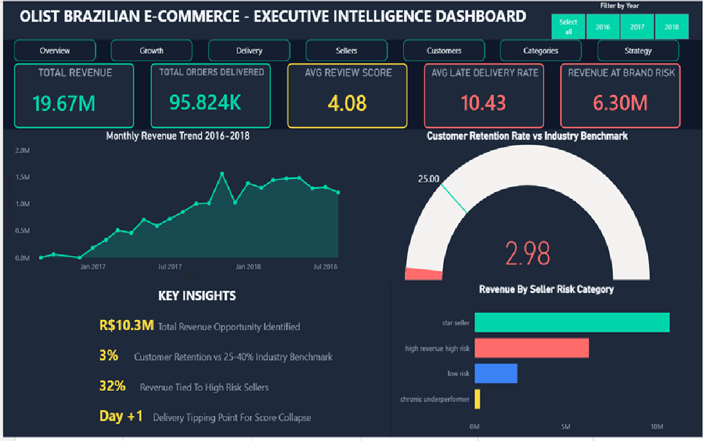
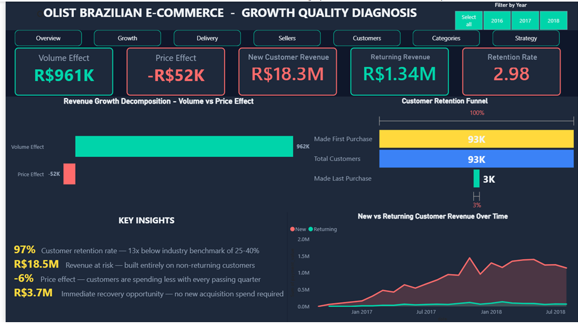
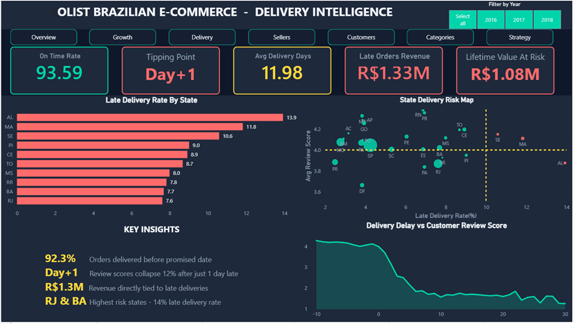
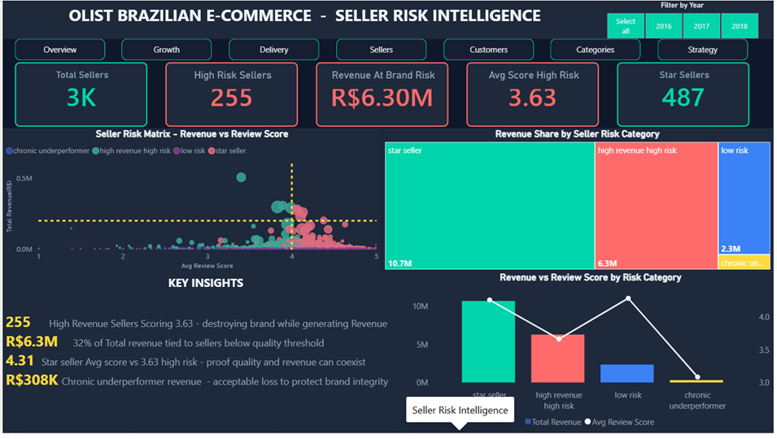
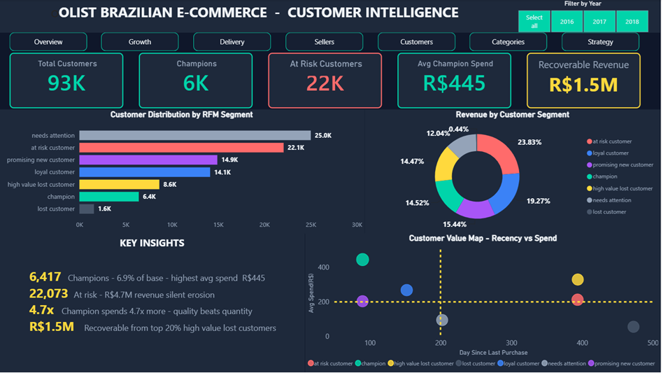
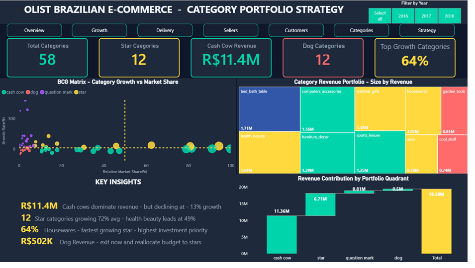
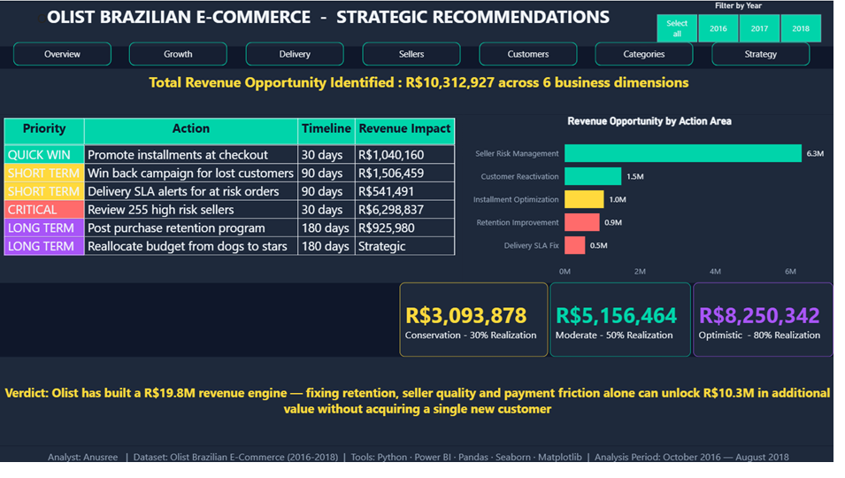
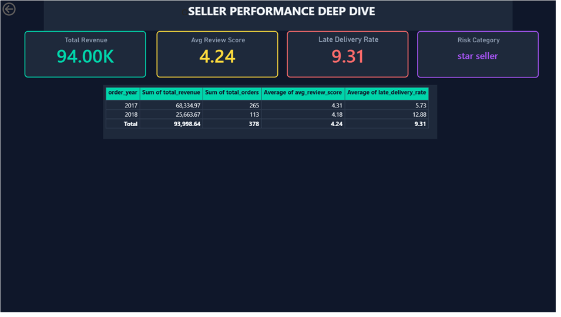
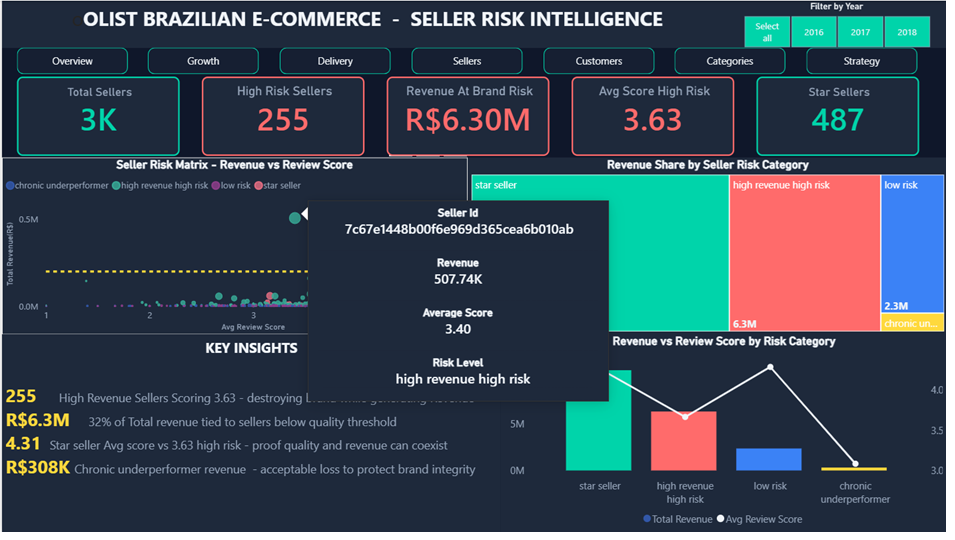

# Olist Brazilian E-Commerce — Revenue Intelligence Dashboard

End-to-end data analysis project identifying R$10.3M in recoverable revenue across a Brazilian e-commerce marketplace, built using Python for exploratory analysis and Power BI for executive reporting.

## The Business Problem

Olist is a marketplace connecting small sellers to major retail channels across Brazil. Looking at 99,441 orders from 2016 to 2018, the surface-level story was strong growth — revenue scaled from R$62K to over R$1.5M monthly. The deeper question was whether that growth was actually sustainable, or whether it was masking structural problems in retention, delivery, and seller quality that would eventually catch up to the business.

## What I Found

**Retention is the core problem.** 97% of customers never make a second purchase. The 3% retention rate sits roughly 13 times below the 25-40% benchmark typical for e-commerce platforms. 93% of total revenue comes from one-time buyers, meaning the business is functionally renting its customer base rather than building one.

**There's a precise delivery tipping point.** Customer review scores hold steady around 4.2 for any order delivered on time or early. The moment an order is even one day late, average review scores collapse from 4.21 to 3.69 — a 12% drop triggered by a single day. 6.7% of all orders are late, putting roughly R$1.08M in customer lifetime value at risk.

**32% of platform revenue runs through high-risk sellers.** 255 sellers generate R$6.3M in revenue while averaging a 3.63 review score, well below the 4.0 quality threshold. Meanwhile, 487 "star" sellers prove that high revenue and high quality aren't mutually exclusive — they average 4.31 with minimal late delivery.

**Customer value is heavily concentrated.** Using RFM segmentation across all 92,747 customers, only 6.9% qualify as champions, while 22,073 are already flagged at-risk, representing R$4.7M in revenue that could disappear without intervention.

**Capital is misallocated across the product portfolio.** Using a BCG matrix framework, R$11.4M sits in declining cash cow categories while 12 high-growth star categories — like health & beauty (49% growth) and housewares (64% growth) — remain underinvested.

**Checkout friction is leaving money on the table.** Customers using installment payments spend up to 225% more per order than single-payment customers, but installments aren't being actively promoted at checkout.

## Quantified Opportunity

| Action Area | Revenue Impact | Priority |
|---|---|---|
| Seller risk management | R$6,298,837 | Critical |
| Customer reactivation | R$1,506,459 | Short term |
| Installment optimization | R$1,040,160 | Quick win |
| Retention program | R$925,980 | Long term |
| Delivery SLA fix | R$541,491 | Short term |
| **Total identified** | **R$10,312,927** | |

## Tools & Approach

**Python (Pandas, NumPy, Matplotlib, Seaborn)** — handled all data cleaning, merging across 8 relational tables, and six chapters of statistical analysis: revenue decomposition, cohort retention analysis, seller risk scoring, RFM segmentation, BCG portfolio classification, and payment friction analysis.

**Power BI** — built a 7-page executive dashboard on top of the Python findings, including:
- DAX measures for live, filterable KPIs (validated against the Python output to confirm consistency)
- A synced year slicer filtering every page simultaneously
- A drill-through page that lets you click into any individual seller's full performance history
- A custom hover tooltip showing seller-level detail on demand
- 5 bookmarks combining specific filter states for guided stakeholder presentations
- One-click navigation buttons across all pages

I deliberately kept a few KPIs as static values rather than forcing them into DAX — specifically the revenue decomposition figures and lifetime-value-at-risk calculation, since those came from multi-step Python logic that doesn't translate cleanly into a single DAX expression without risking an inaccurate number on the dashboard. I'd rather show a correct static figure than a dynamic one I can't fully verify.

**[Download the Power BI file](dashboard_file/project1.pbix)** to explore the dashboard in Power BI Desktop.
## Dashboard Pages

**1. Executive Overview** — 

**2. Growth Quality Diagnosis** — 

**3. Delivery Intelligence** — 

**4. Seller Risk Intelligence** — 

**5. Customer Intelligence** — 

**6. Category Portfolio Strategy** — 

**7. Strategic Recommendations** — 

**8. Seller Detail (Drill-Through)** — 

Clicking any seller bubble on Page 4 drills through to this page, filtered to that specific seller's revenue, review score, late delivery rate, and year-by-year order history.

**9. Seller Hover Tooltip** — 

Hovering over any seller bubble on Page 4 shows this custom card instead of Power BI's default tooltip.

## Repository Structure

notebooks/             Python EDA notebook (6 analytical chapters)
eda_visuals/            All Python-generated charts
dashboard_screenshots/  Screenshots of all 9 dashboard pages
dashboard_file/         The working Power BI (.pbix) file

## Dataset
[Olist Brazilian E-Commerce Public Dataset](https://www.kaggle.com/datasets/olistbr/brazilian-ecommerce), from Kaggle. 99,441 orders across 8 relational tables, October 2016 through August 2018.

## Analyst
Anusree
